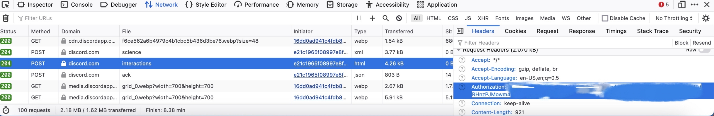
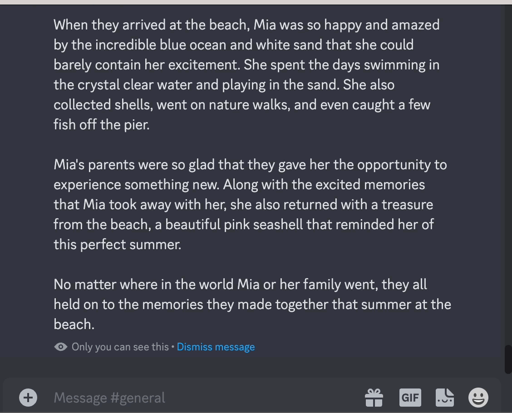
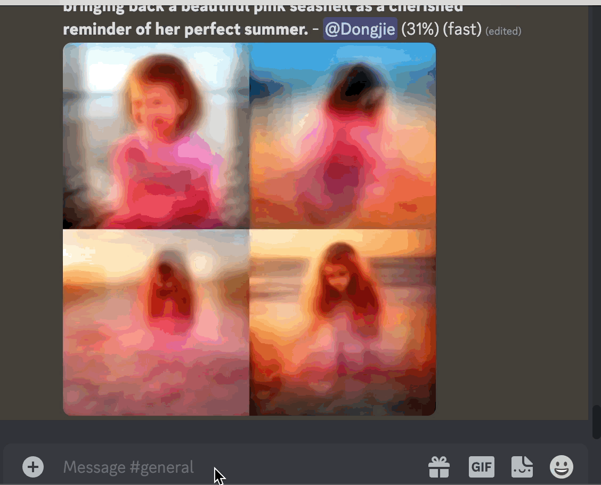
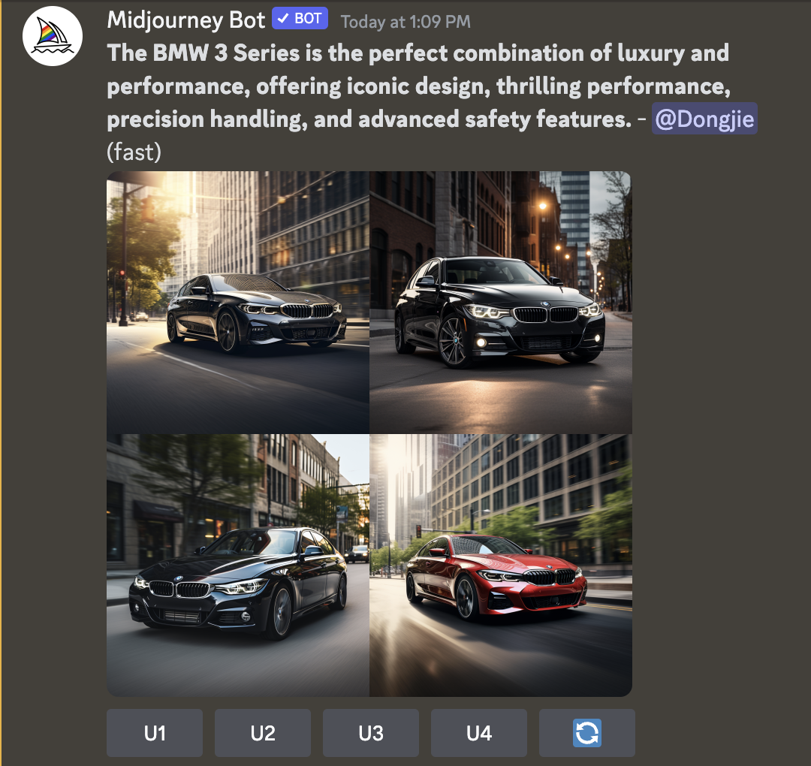
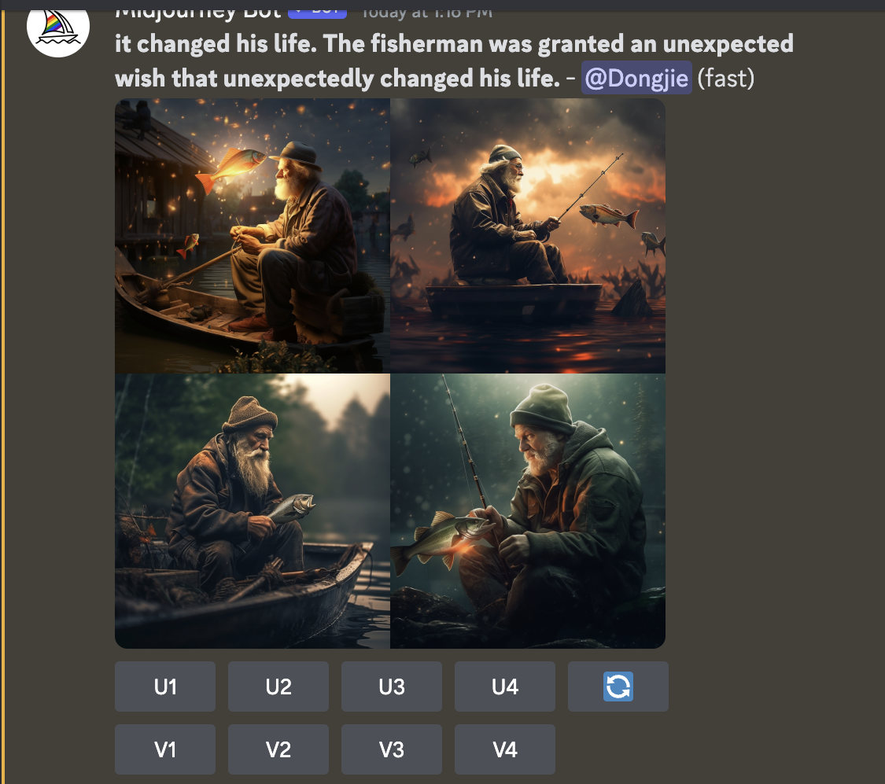
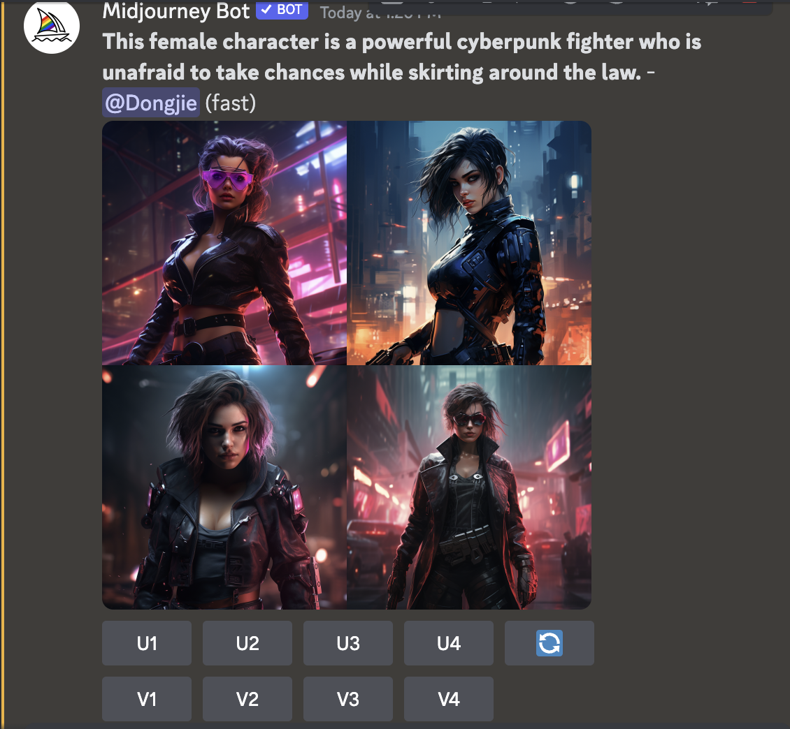
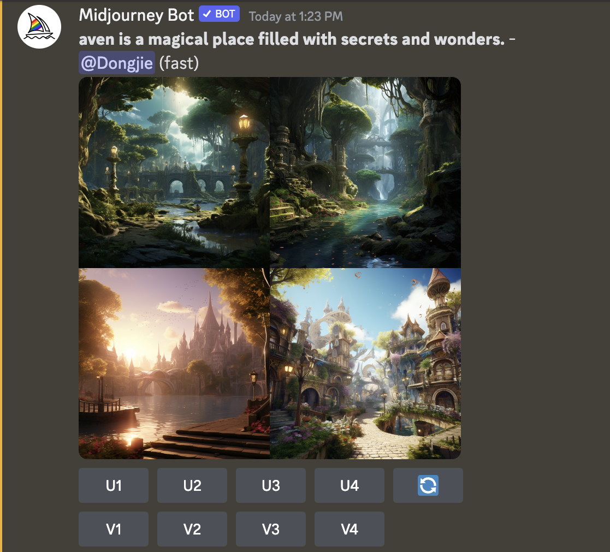
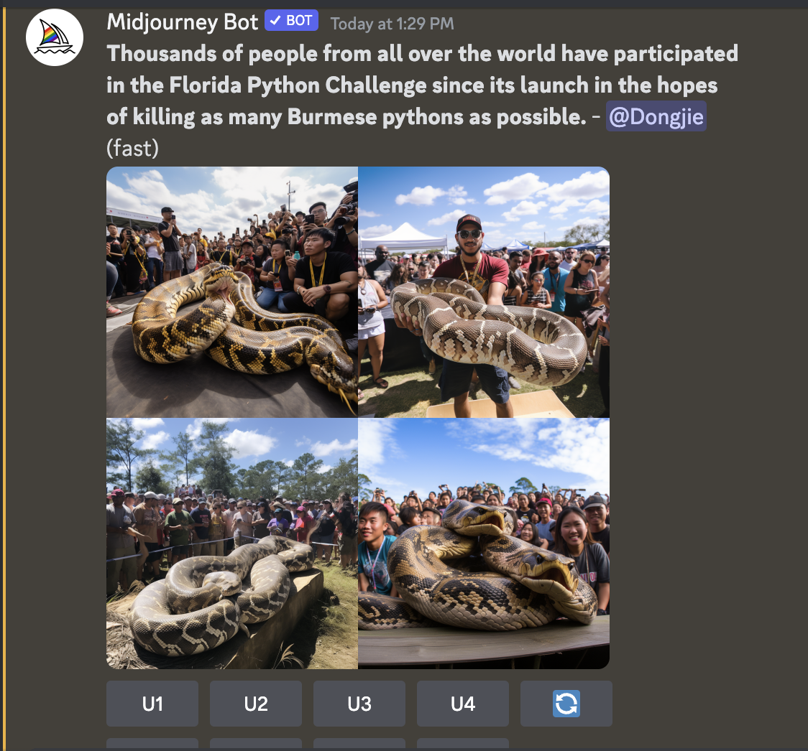
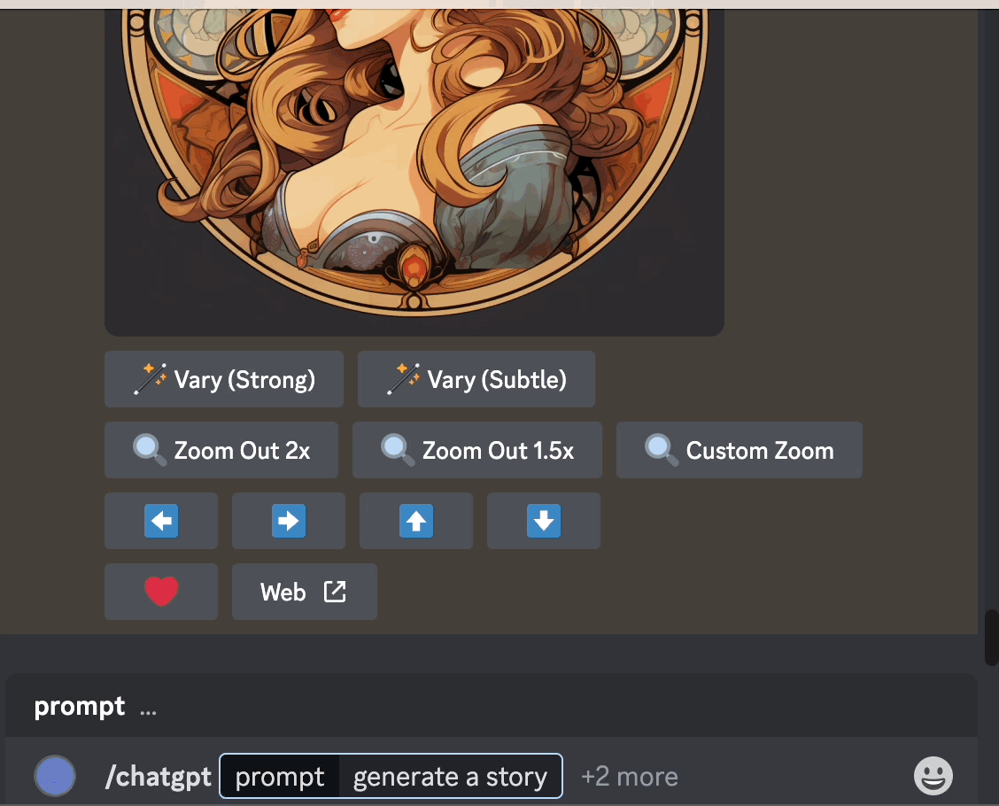

# MuChaAPI

# Introduction

MuChaAPI combines Midjourney and ChatGPT to faciliate content creating. Allowing users to call it from Discord or from a restful backend service(TODO). The following is a list of main features:

- `/muse` creates an image / multiple images(TODO) given a long text.
- `/mucha` generates a long text with an image / multiple images(TODO) based on the prompt you sent.

The following listed several use cases:

- Write advertisement with images
- Write a fairytale with images
- Generate a character with descriptions and images
- Create a fantasy world with descriptions and images
- Generate an image for a piece of news

You can also interact with ChatGPT in the Discord using `/chatgpt` or summarize the article using `/summarize`.

# Install

- Clone the project
- Create an .env in the root folder
- Add the environment variable to .env base on the following:

```json
DISCORD_TOKEN=[YOUR DISCORD TOKEN WHICH IS THE BOT TOKEN]
USER_TOKEN=[YOUR USER TOKEN]
CHANNEL_ID=[YOUR CHANNEL ID]
GUILD_ID=[YOUR GUILD ID]
APPLICATION_ID=[YOUR APPLICATION ID]
SESSION_ID="0deb67ca254c9362f66f4540d843598e"
OPENAI_API_KEY=[YOUR OPENAI API KEY]
```

> For USER_TOKEN, open discord on your browser, open the web developing tools, click the network tab, then use a random interaction, look for interaction post and its header. The USER_TOKEN is the Authorization in the header



# Main Feature

## Discord

### Generating images based on a long text block (article / report / blog / story )

```json
/muse [prompt: str]
```



This command can be use for generate an image / or multiple images (up to 9 yet to develop) for a piece of news, for a story, or for a blog

[GIF HERE]

### Generate a long text with several images based on the prompt to ChatGPT

```json
/mucha [prompt: str]
```



## Use Case:

### Write advertisement with images

```json
/mucha write me an advertisement for a BMW car
```

MuCha Reply: Introducing the BMW 3 Series – the perfect blend of luxury and performance. Combining an iconic design with thrilling performance, the BMW 3 Series is the ultimate driving machine. Enjoy the precision handling and superior power of BMW’s signature TwinPower Turbo engines while taking in the breath-taking views and luxurious interior. With advanced safety features from Park Distance Control and Attention Assist, you can stay in control at all times. Experience the legendary BMW 3 Series today and fulfill your need for speed.



### Write a fairytale with an image

```json
/mucha write me an Andersen fairytale
```

Mucha Reply:

Once upon a time, there was a fisherman who lived in a small fishing village near the beach. Every day he went out to sea, in hope of bringing back a large catch to feed his family. One day, his net was so full of fish that he had trouble getting it on board the boat. Trying to get the net over the side, the fisherman felt something tugging from the depths. As he looked closer, he could make out the shape of a mermaid with long, golden hair.

The mermaid pleaded with him to set her free and promised to grant him his heart's desire if he did. But the fisherman, ever practical, asked for something simpler: an impossible wish. The mermaid, taken aback, asked him for an example.

"I want a golden scale to keep in a pouch around my neck," the fisherman replied. "Whenever I'm out at sea, I want to be able to reach into the pouch to know if I'm about to catch a good catch or not".

The mermaid, admiring both the man's practicality and his creativity, granted his wish. And sure enough, with the help of the golden scale, the fisherman managed to bring back an ever-increasing abundance of fish to his family.

The moral of the story? True wishes don't need to be flashy or even common to be granted. All they need is faith and a little imagination.



### Generate a character with a portrait

```json
/mucha describe a cyberpunk female character
```

This female character is a daring cyberpunk, living her life on the edge of the law. She's an expert hacker with years of experience under her belt. She wears a black leather trench coat covered in tech patches, a means of showing off her expertise and experience. Her cybernetic enhancements are integrated seamlessly into her body, granting her enhanced vision, amplified reflexes, and the ability to quickly access online databases.

Her native language is computer code, and she’s become a master of virtual reality. Her silver hair marks her as an expert in the digital world, and she loves using it to her advantage. Her cyberpunk fashion style reflects her strong individualism, and she likes to stand out from the crowd.

Altogether, she's a powerful cyberpunk fighter who’s not afraid to take chances. She moves through the futuristic cityscape with ease and elegance. Whether she’s skirting around the law or just trying to make a living, she always manages to stay one step ahead.



### Describe a fantasy world with an image

```json
/mucha describe a fantasy world in details
```

This fantasy world is a magical and dynamic place called Nistaven. It is filled with all kinds of wonders for the brave adventurer to explore. Nestled in the evergreen-covered mountains that soar high up into the clouds, Nistaven is endlessly mysterious and beautiful.

The enchanting kingdom of Nistaven is home to many strange and fascinating creatures, both familiar and fantastical. All manner of beasts roam the rolling grasslands, from the majestic griffins that soar over the tops of the mountains, to the small sprites that flutter about the glacial streams. At night, the sky is ablaze with stars, and the grasslands come alive with the twinkling lights of fairies, their enchanting music weaving around the valleys and hills.

The people of Nistaven are a friendly folk who respect nature and honor their traditions. Ancient temples and tombs can be found in the wilderness, documenting the long and tumultuous history of this land. There are also strange magical strongholds nestled away in untamed corners of the kingdom, some of which are said to contain powerful secrets.

Overall, desire and adventure will always find a home in Nistaven, and many are drawn in by its promises of undiscovered truths and the potential for something greater.



### Generate an image for a piece of news

News source: [https://www.bbc.com/news/world-us-canada-66206671](https://www.bbc.com/news/world-us-canada-66206671)

**In the decade since Florida launched its first public contest to kill Burmese pythons, thousands of people from all over the US and around the world have staked their hopes on killing as many of the massive serpents as they can.**

Jake Waleri, 22, has one major plan for his summer break from the University of Ohio: hunt snakes.

The native of Naples, Florida, says he's always known about the issue of Burmese pythons, an invasive species that has taken over the Everglades, and the havoc they wreak on Florida's natural habitat.

He became interested in python hunting after watching professional hunters on television, and started hunting them himself two years ago. Last year, he entered the Florida Python Challenge - the state's annual python hunting contest - but dropped out because he was too far behind in the rankings. "This year I want to win it," he says. The Florida Python Challenge draws in hundreds of participants each year from as far away as Canada, Belgium and Latvia who are charmed by the
prospect of fame and fortune, including up to $30,000 (£23,600) in prize money.

```json
/muse [news text above]
```



### Interacting with ChatGPT

```json
/chatgpt [prompt: str]
```



## TODO:

1. generate multiple images based on a long text
2. A Backend restful API for automated content generation.
3. Generate an image based on an article and an image
